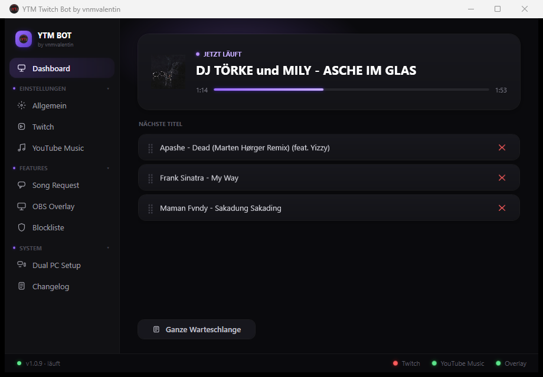
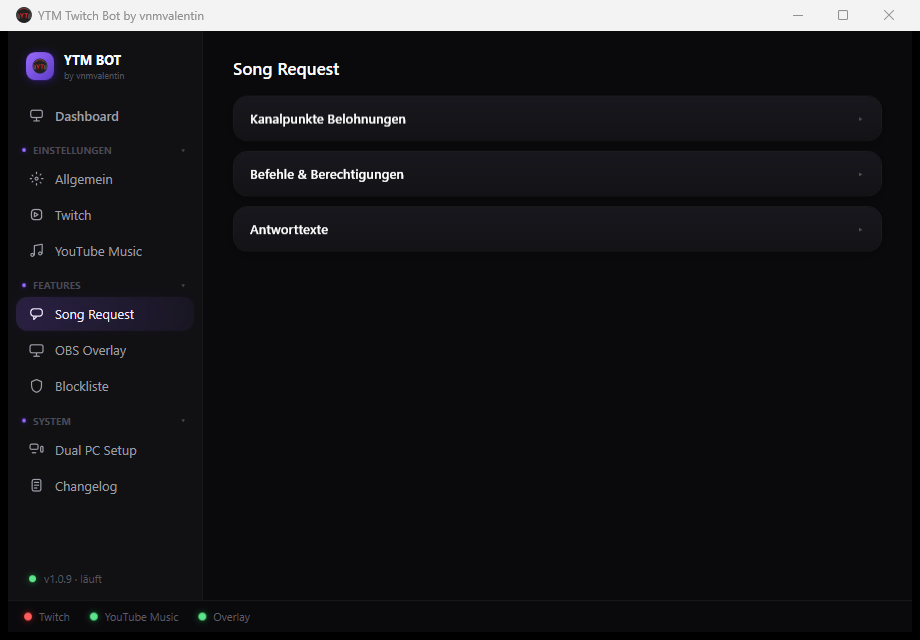

# YTM Twitch Bot

**Twitch-Chatbot für Song Requests aus YouTube Music – inklusive OBS-Overlay.**

Zuschauer wünschen sich Songs per Chat-Befehl oder Kanalpunkte, der Bot sucht sie auf YouTube Music, reiht sie in die Warteschlange ein und zeigt den aktuellen Song live als Overlay in OBS an. Läuft als schlanke Windows-Hintergrund-App.

  

  

---

## Inhalt

- [Features](#features)
- [Voraussetzungen](#voraussetzungen)
- [Installation](#installation)
- [Einrichtung](#einrichtung)
  - [1. Pear Desktop verbinden](#1-pear-desktop-verbinden)
  - [2. Mit Twitch verbinden](#2-mit-twitch-verbinden)
  - [3. Befehle & Berechtigungen](#3-befehle--berechtigungen)
  - [4. Kanalpunkte-Belohnungen](#4-kanalpunkte-belohnungen)
  - [5. OBS-Overlay einrichten](#5-obs-overlay-einrichten)
  - [6. Dual-PC-Setup (optional)](#6-dual-pc-setup-optional)
- [Chat-Befehle](#chat-befehle)
- [Konfiguration & Daten](#konfiguration--daten)
- [Support](#support)

---

## Features

**Song Requests**
- Songwünsche per Chat-Befehl (`!sr`) **oder** per Kanalpunkte-Belohnung
- Erkennt YouTube-Links, YouTube-Music-Links **und** Spotify-Links (wird automatisch auf YouTube Music gesucht)
- Intelligentes Matching (Titel/Artist-Abgleich, erkennt Remixes/Live-Versionen/Karaoke & Co., damit nicht versehentlich die falsche Version läuft)
- Song wird automatisch direkt hinter den aktuell laufenden bzw. zuletzt gewünschten Song einsortiert
- Maximale Songdauer einstellbar
- Blockliste für Artists/Songs und für einzelne Nutzer
- Punkte werden bei Fehlern automatisch erstattet (Song nicht gefunden, blockiert, zu lang, YTM nicht erreichbar) – erfolgreiche Einlösungen bleiben zur manuellen Bestätigung stehen

**Warteschlange**
- Dashboard mit aktuellem Song und den nächsten Titeln
- Songs per Drag & Drop in der Warteschlange verschieben oder entfernen
- Volle Warteschlangenansicht separat einsehbar

**OBS-Overlay**
- Zeigt Cover, Titel, Artist und einen Fortschrittsbalken mit Sekundenanzeige (live, ohne sichtbares "Springen")
- "Als Nächstes"-Panel: dauerhaft sichtbar oder blendet sich automatisch kurz vor Songende ein
- Vollständig im Browser konfigurierbar (Farben, Transparenz, Eckenradius, Breite, Scroll-Geschwindigkeit) mit Live-Vorschau – kein Editieren von Dateien nötig
- Läuft als eigener kleiner Webserver, URL wird einfach als Browser-Quelle in OBS eingefügt

**Sonstiges**
- Autostart mit Windows
- Automatische Updates
- Dual-PC-Unterstützung (Bot läuft auf einem PC, Musik auf einem anderen)

---

## Voraussetzungen

| Voraussetzung | Hinweis |
|---|---|
| **Windows 10/11 (x64)** | Der Bot ist eine WPF-Desktop-App |
| **[Pear Desktop](https://github.com/pear-devs/pear-desktop)** | YouTube-Music-Desktop-Client mit lokaler API – darüber steuert der Bot die Wiedergabe |
| **Ein Twitch-Account** | Für den Bot selbst – kann dein Hauptaccount oder ein separater Bot-Account sein |
| **OBS Studio** *(optional)* | Nur nötig, wenn du das Song-Overlay im Stream zeigen willst |

---

## Installation

1. Aktuellste Version aus den [Releases](https://github.com/vnmvalentin/YTM_Twitch_Bot/releases) herunterladen und entpacken.
2. `YtmTwitchBot.exe` starten – keine Installation nötig, läuft portabel.
3. Der Bot prüft beim Start automatisch auf Updates.

---

## Einrichtung

### 1. Pear Desktop verbinden

1. [Pear Desktop](https://github.com/pear-devs/pear-desktop) installieren, öffnen und einen Song abspielen.
2. In Pear Desktop: **Einstellungen → Erweiterungen → API-Server → aktivieren**.
3. Autorisierungs-Methode auf **„Keine Autorisierung"** stellen.
4. Im Bot unter **YouTube Music** den Port eintragen (Standard: `26538`) – passt in der Regel ohne Änderung.

### 2. Mit Twitch verbinden

1. Im Bot zum Tab **Twitch** wechseln und **„Mit Twitch verbinden"** klicken.
2. Im sich öffnenden Browser-Fenster mit dem gewünschten Account einloggen und die Berechtigung bestätigen.
3. Der Bot verbindet sich danach automatisch mit deinem Chat (EventSub/IRC) – Status unten links in der App ("Twitch") wird grün.

> Ein eigener Twitch-Developer-App-Eintrag ist **nicht** nötig, die Anmeldung ist bereits im Bot integriert.

### 3. Befehle & Berechtigungen

Unter **Song Request → Befehle & Berechtigungen** lässt sich pro Befehl einstellen:
- Aktiv/Inaktiv
- Alias (z. B. `!sr`, mehrere Aliase mit `;` trennen)
- Wer den Befehl nutzen darf (Alle / Subs / VIPs / Mods)

Unter **Song Request → Antworttexte** lassen sich alle Chat-Antworten frei anpassen (Platzhalter wie `{user}`, `{artist}`, `{title}` werden per Info-Symbol angezeigt).

### 4. Kanalpunkte-Belohnungen

1. Unter **Song Request → Kanalpunkte Belohnungen** auf **„+ Neu erstellen"** klicken (für Song-Request und/oder Skip).
2. Name und Punktekosten festlegen.

> ⚠️ Belohnungen **müssen** über den Bot selbst erstellt werden (`+ Neu erstellen`), nicht manuell auf der Twitch-Seite. Twitch erlaubt das automatische Einlösen/Erstatten von Punkten nur bei Belohnungen, die von der jeweiligen App erstellt wurden.

### 5. OBS-Overlay einrichten

1. Im Tab **OBS Overlay** den Webserver aktivieren.
2. Auf **„⚙️ Overlay-Konfiguration im Browser öffnen"** klicken.
3. Im Browser Design, Farben, Größe etc. nach Wunsch einstellen (wirkt sofort in der Live-Vorschau) und rechts oben auf **„Link für OBS kopieren"** klicken.
4. In OBS: **Quelle hinzufügen → Browser-Quelle** → Link einfügen → Breite/Höhe entsprechend der im Konfigurator angezeigten Empfehlung setzen.

  

### 6. Dual-PC-Setup (optional)

Läuft die Musik (Pear Desktop) auf einem **anderen** PC als der Bot (z. B. separater Stream-PC), unter **Dual PC Setup** die lokale Netzwerk-IP des Musik-PCs eintragen. Bei einem Single-PC-Setup bleibt hier `127.0.0.1` stehen.

---

## Chat-Befehle

| Befehl | Standard-Alias | Standard-Berechtigung | Beschreibung |
|---|---|---|---|
| Song Request | `!sr` *(standardmäßig deaktiviert)* | Alle | Song zur Warteschlange hinzufügen |
| Aktueller Song | `!song` | Alle | Zeigt aktuell laufenden Song (+ Wunsch-User, falls vorhanden) |
| Warteschlange | `!q`, `!queue` | Alle | Zeigt die nächsten Songs |
| Skip | `!skip` | Mods | Überspringt den aktuellen Song |
| Letzter Song | `!lastsong`, `!prev` | Alle | Zeigt den zuletzt gespielten Song |

Aliase und Berechtigungen sind pro Befehl frei einstellbar (siehe [Befehle & Berechtigungen](#3-befehle--berechtigungen)).

---

## Konfiguration & Daten

Alle Einstellungen (inkl. Twitch-Zugangsdaten) werden lokal in `settings.json` neben der `.exe` gespeichert.

> 🔒 **Diese Datei enthält deinen Twitch-Zugangs-Token – niemals teilen oder öffentlich hochladen** (z. B. in Screenshots, Support-Anfragen oder Backups).

---

## Support

Fragen, Probleme oder Vorschläge? Komm auf den **[Discord-Server](https://discord.gg/RUTPseGJBn)**.

Ein vollständiges Changelog aller Versionen findest du direkt in der App unter **System → Changelog**.
